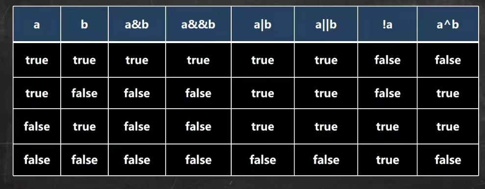

# 第三章 运算符

## 运算符介绍
1. 算数运算符
2. 赋值运算符
3. 关系运算符【比较运算符】
4. 逻辑运算符
5. 位运算符【需二进制基础】
6. 三元运算符


## 关系运算符
1. == 相等于
2. != 不等于
3. \>
4. <
5. \>=
6. <=
7. instanceof 判断某一对象是否为某一类


## 逻辑运算符


&& 和 & 的区别
1. &&短路与：如果第一个条件为false。则不判断第二个条件返回false
2. &逻辑与：两个都会进行判断，然后根据上表返回，效率更低
3. 开发中，一般使用短路与&&

|| 和 | 的区别
1. &&短路或：如果第一个条件为true。则不判断第二个条件返回true
2. &逻辑或：两个都会进行判断，然后根据上表返回，效率更低
3. 开发中，一般使用短路或||

## 赋值运算符 assignOperator
### 特点：
1. 运算顺序从右向左
2. 左边只能是变量，右边可以是变量、表达式、常量
3. a += 3 => a = a + 3
4. 复合赋值运算符会进行类型转换

## 三元运算符
### 运算规则
1. 如果条件表达式为true，返回结果1
2. 如果条件表达式为false，返回结果2

```java
int a = 10;  
int b = 9;  
int res = a > b : a ? b; // 二者取大值  
```
    

### 运算符优先级


## 标识符的命名规则和规范

### 标识符概念
1. Java对各种变量、方法、类的命名时使用的字符序列被称为标识符。
2. 凡是自己可以取名的地方都叫标识符。

### 命名规则
1. 由26个应为字母大小写，0-9，_或者$组成
2. 数字不可以开头
3. 不可以使用关键字和保留字
4. 严格区分大小写，长度无限制
5. 标识符不能包含空格

### 命名规范
1. 包名：多单词组成时所有字母小写 com.hsp.crm
2. 类名、接口名：多单词组成时，所有单词的首字母大写【大驼峰】
3. 变量名、方法名：第一个单词首字母小写，第二个单词开始首字母大写：XXXYyyZzz【小驼峰】
4. 常量名：所有字母大写，多单词使用_相连，如XXX_YYY_ZZZ

### 关键字 保留字
太多了 不写了

## 键盘输入指令
```java
Scanner input = new Scanner(System.in); //创建Scanner的对象
System.out.print("请输入名字：");
String name = input.next();
System.out.print("请输入年龄：");
int age = input.nextInt();
System.out.print("请输入薪水：");
double sal = input.nextDouble();
System.out.println("名字:" + name + "年龄:" + age + "薪水:" + sal);
    
```


## 进制

1. 二进制
2. 十进制
3. 八进制
4. 十六进制

```java
int n1 = 0b1010;    // 二进制
int n2 = 01010;     // 八进制
int n3 = 1010;      // 十进制
int n4 = 0x1010;    // 十六进制
```

### 进制转换
#### 二、八、十六转十进制
1. 二进制转十进制
> 从最低位（右边）开始，将每个位上的数提取出来，乘以2的（位数【最右边为第1位】 - 1）次方，然后求和。
2. 八进制转十进制
> 从最低位（右边）开始，将每个位上的数提取出来，乘以8的（位数【最右边为第1位】 - 1）次方，然后求和。
3. 八进制转十进制
> 从最低位（右边）开始，将每个位上的数提取出来，乘以16的（位数【最右边为第1位】 - 1）次方，然后求和。
#### 十进制转二、八、十六
1. 十进制转二进制
> 将该数不断除以2，知道商为0为止，然后将每一步的余数倒过来就是对应的二进制
2. 十进制转八进制
> 将该数不断除以8，知道商为0为止，然后将每一步的余数倒过来就是对应的八进制
3. 十进制转八进制
> 将该数不断除以16，知道商为0为止，然后将每一步的余数倒过来就是对应的十六进制
#### 二进制转八、十六
1. 二进制转八进制
> 三位一取
1. 二进制转十六进制
> 四位一取
#### 八、十六转二进制
1. 八进制转二进制
> 一位变三位
2. 十六进制转二进制
> 一位转四位

## 原码、反码、补码
1. 二进制的最高位是符号位，0正1负
2. 正数的原码、反码、补码一样（三码合一）
3. 负数的反码 = 符号位不变，其他位取反
4. 负数的补码 = 反码 + 1， 负数的反码 = 补码 - 1
5. 0 的反码、补码都为0
6. Java没有无符号数
7. 计算机运算时，都是以**补码的方式**运算的
8. 看运算结果时候，看的是结果的原码

## 位运算符
1. 按位与 & :   全1为1，否则为0
2. 按位或 | ：  全0为0，否则为1
3. 按位异或 ^ : 同0异1
4. 按位取反 ~ ：0 -> 1 1 -> 0 

## 算数移位 和 逻辑移位
1. 算数右移 >> ：低位溢出，符号位不变，用符号为补高位
2. 算数左移 << ：符号位不变，低位补0
3. 逻辑右移>>> ：也称为无符号右移，低位溢出，高位补0
4. 没有 逻辑左移<<<

