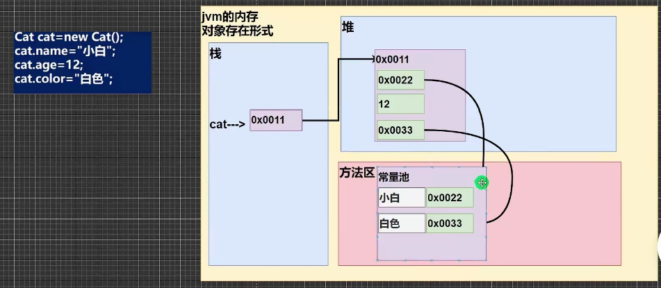
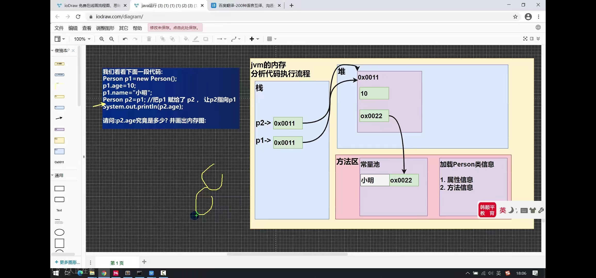

# 第六章 类与对象
## 对象在内存中的存在形式


## 属性
成员变量 = 属性 = field

## 访问修饰符（后面讲）
protected  
private  
public  
默认

## 对象的复制
```java
Person p1 = new Person();
p1.age = 10;
p1.name = "小敏";
Person p2 = p1;
System.out.println(p2.age);
```

其中，类信息只会加载一次。

## 成员方法
## 方法不可嵌套定义
## 同一个类的方法可以直接调用
## 跨类调用（使用对象名调用）
```java
class A{
    public void m1(){
        B b = new B();
        b.hi();
    }
}
class B{
    public void hi(){
        System.out.println("hi");
    }
}
```
## 成员方法传参机制


## 递归调用

## 递归执行机制

```java
public void test(int n){
    if(n > 1){
        test(n - 1);
    }
    System.out.println("n = " + n);
}
// out
// n = 1
// n = 2
// ...
// n = n
```

```java
// 阶乘递归实现
public int factorual(int n){
    if(n == 1){
        return n;
    }
    return n * factorual(n - 1);
}

```
汉诺塔问题   HanoiTower
八皇后问题   EightQueen

## 方法重载的细节
1. 方法名相同
2. 形参类型或形参个数不同，参数名无要求
3. 返回类型无要求, 只有返回类型不同，不可以重载


## 可变参数
基本概念：java允许将同一个类中，多个同名同功能但参数个数不同的方法，封装成一个方法
例：VarParameter.java

## 作用域

1. 局部变量一般指在成员方法中定义的变量
2. 成员变量是在类中定义的变量，可以直接在该类的方法中使用
3. 全局变量可以直接使用，因为有默认值；局部变量不可以直接使用，需要先赋值

## 作用域的注意事项

1. 局部变量和全局变量重名时， 访问遵循就近原则
2. 同一个作用域中只能有一个name，不可以有多个同名变量
3. 全局变量可以添加修饰符，局部变量不可以加修饰符

## 构造器 constructor
作用：完成对新对象的初始化
1. 方法名和类名相同
2. 没有返回值
3. 在创建对象时，系统会自动的调用该类的构造器完成对象的初始化


# 继承细节
1. 子类继承了所有的属性和方法，但是私有属性和私有方法不能在子类中直接访问，要通过公有的方法访问
2. 子类必须调用父类的构造器，完成父类的初始化
3. 当创建子类对象时，不管子类使用哪个构造器，都默认调用父类的无参构造器，如果父类没有提供无参构造器，则必须在子类中使用super指定父类的构造器，否则编译会不通过
4. 显式调用super(参数列表)
5. super使用时，需要在构造器的第一行
6. super() 和 this()都只能放在第一行，因此这两个方法不能同时存在一个构造器内
7. java所有类都是Object的子类
8. 父类构造器的调用不限于父类！将一直向上追溯到Object类【ctrl + h 查看类的继承关系】
9. 子类最多只能继承一个父类，单继承【A继承B，B继承C => A继承B、C】
10. 不能滥用继承，子类和父类之间必须满足is-a的逻辑关系

## super关键字
- 基本介绍
super代表父类的引用，用于访问父类的方法属性构造器
- 基本语法
1. 访问父类的属性，super.属性名【不能访问私有属性】
2. 访问父类的方法，super.方法(参数列表)【不能访问私有方法】
3. 访问父类的构造器


