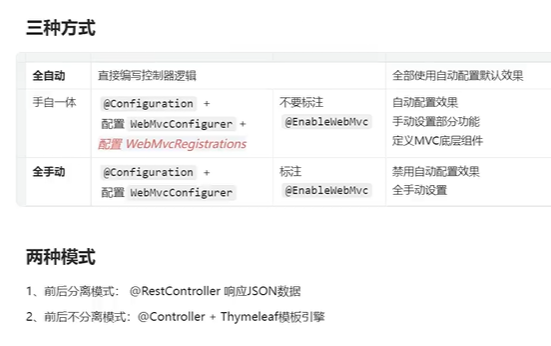
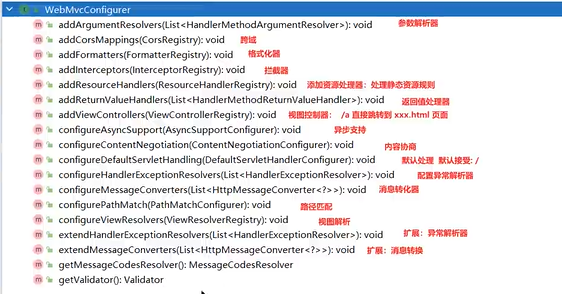
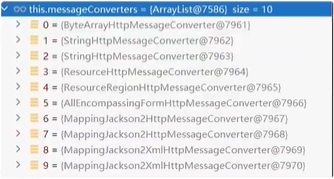

# 核心特性
## 快速入门

### 特性: 
1. 快速创建spring应用
2. 直接嵌入Tomcat、Jetty（Servlet容器）
3. 提供可选的starter，简化应用整合，例如web-starter，就自动配置了关于web开发所需的包、mybatis-starter
4. 按需配置Spring以及第三方库（约定大于配置）
5. 提供生产级特性：如监控指标、健康检查、外部化配置【不用修改源码，而是修改外部配置，就可以更新项目】
6. 无代码生产、无XML  
总结：简化开发、简化配置、简化整合、简化部署、简化监控、简化运维

### 开发流程：
1. maven项目
```xml
<!-- 所有项目都需要继承的父项目 -->
<parent>
    <groupId>org.springframework.boot</groupId>
    <artifactId>spring-boot-starter-parent</artifactId>
    <version>3.0.13</version>
</parent>

```
2. 导入场景  【web场景】
```xml
<!-- web开发 -->
<dependencies>
    <dependency>
        <groupId>org.springframework.boot</groupId>
        <artifactId>spring-boot-starter-web</artifactId>
    </dependency>
    <dependency>
        <groupId>org.springframework.boot</groupId>
        <artifactId>spring-boot-autoconfigure</artifactId>
        <version>3.0.13</version>
    </dependency>
</dependencies>
```
3. 主程序 
```java
@SpringBootApplication
public class MainApplication {
    public static void main(String[] args) {
        SpringApplication.run(MainApplication.class, args);
    }
}
```
4. 业务
```java
@RestController
public class HelloController {
    @GetMapping("/hello")
    public String hello(){
        return "hello spring boot 3";
    }
}
```
5. 打包
```xml
<!-- spring Boot应用打包插件 -->
<build>
    <plugins>
        <plugin>
            <groupId>org.springframework.boot</groupId>
            <artifactId>spring-boot-maven-plugin</artifactId>
        </plugin>
    </plugins>
</build>
```
使用命令 mvn clean jar 打成jar包

### 特性小结
1. 简化整合  
- 导入相关的场景，即拥有相关功能  
- 各种场景starter：https://docs.spring.io/spring-boot/docs/3.0.13/reference/html/using.html#using.build-systems.starters  
- 官方提供的starter：spring-boot-starter-*  
- 第三方提供的starter：*-spring-boot-starter    
- 可以外部配置，使用application.properties  

2. 简化开发
- 无需关注配置，直接业务开发
3. 简化配置
- 集中式管理各种配置， application.properties 可以编辑的配置：https://docs.spring.io/spring-boot/docs/3.0.13/reference/html/application-properties.html#appendix.application-properties.json
4. 简化部署
- 打包为jar，linux有java环境即可使用 `java -jar ***.jar` 运行
5. 简化运维
- 修改配置（外部使用application.properties）、监控、健康检查

### Spring Initializer
简单初始化
## 应用分析
### 依赖管理机制
1. 为什么导入starter，所有相关的包都会自动导入
- 开发什么场景，导入什么场景启动器
- maven依赖传递原则，A-B-C，A就拥有B、C
2. 为什么版本号不用谢
- 每个boot项目都有一个父项目 `spring-boot-start-parent`
- parent的父项目是 `spring-boot-dependencies`
- dependencies 会进行依赖管理【版本仲裁中心，常见的依赖版本都声明过】
3. 自定义版本号【就近原则】
- 直接在项目的properties标签中声明
- 直接在导入包的依赖中声明
4. 第三方jar包【例如druid】
- boot父项目没有管理的需要自行选择版本
### 自动配置机制
1. 初步理解
- 自动配置Tomcat、SpringMVC等
```java
public static void main(String[] args) {
    // java10 使用var作为局部变量的自动推断
    var ioc = SpringApplication.run(Boot302DemoApplication.class, args);
    String[] names = ioc.getBeanDefinitionNames();
    for(String name: names){ // 查看容器中的组件，有哪些组件就有哪些功能
        System.out.println(name);
    }
}
```
- 默认的包扫描规则
    - @SpringBootApplication 注解标注的就是主程序
    - SpringBoot只会扫描主程序所在的包和子包
    - 可以使用自定义扫描路径 `@SpringBootApplication(scanBasePackages="com.zf")` 或者 `ComponentScan("com.zf")`

- 配置默认值
    - 配置文件的某个配置项是和某个类的对象进行一一绑定的
    - 绑定了属性文件某个值的类是 **配置属性类**
    - Application properties：[官网文档](https://docs.spring.io/spring-boot/docs/3.0.13/reference/html/application-properties.html#appendix.application-properties.json)
- 按需加载、自动配置
    - 导入spring-boot-starter-web
    - 除了会导入相关功能，还导入了`spring-boot-starter`, 这个是所有starter的starter【基础核心starter】
    - `spring-boot-starter`导入了一个包`spring-boot-autoconfigure`,包里是各种场景的AutoConfiguration **自动配置类**
    - 虽然全场景的自动配置都在autoconfigure中，但是只有导入的才会生效
- 总结： 导入场景启动器，触发`spring-boot-autoconfig`这个包的自动配置生效，容器中就会具有相关场景的功能。

## 核心技能
### 常用注解
1. 组件注册
    - `@Configuration` `SpringBootConfiguration`
    - `@Bean`
    - `@Scope`
    ```java
    @Configuration // 这就是配置类
    public class AppConfig {
        @Scope("prototype") // 多实例，默认为单例
        @Bean // 代替之前的bean标签，组件在容器中的名字是方法名，可以使用@Bean("anothername")修改名字
        public User user(){
            var user = new User();
            user.setId(1L);
            user.setName("zifei");
            return user;
        }
    }
    ```
    1. @Configuration 编写配置类
    2. 配置类中使用自定义方法，配合`@Bean`
    3. 使用`@Import`注解导入第三方的组件`@Import(DruidRuntimeException.class)`

2. 条件注解
    - 如果条件满足，则触发【例如：路径中存在这个类，就触发】
    场景：
    ```
    如果存在 DruidRuntimeException 这个类，就生成一个Cat组件，名为cat01
    否则，就生成一个Dog组件，名为dog01
    如果有dog01这个组件，就放User组件，名为zhangsan
    否则放User组件，名为lisi
    ```
    ```java
    // 配置类
    @Configuration
    public class AppConfig2 {
        @ConditionalOnClass(name = "com.alibaba.druid.DruidRuntimeException")
        @Bean
        public Cat cat01(){
            return new Cat();
        }

        @ConditionalOnMissingClass(value = "com.alibaba.druid.DruidRuntimeException")
        @Bean
        public Dog dog01(){
            return new Dog();
        }
        @ConditionalOnBean(name="dog01")
        @Bean
        public User zhangsan(){
            return new User();
        }
        @ConditionalOnMissingBean(name="dog01")
        @Bean
        public User lisi(){
            return new User();
        }
    }
    ```
    ```java
    // 查看有哪些bean
    public static void main(String[] args) {
        var ioc = SpringApplication.run(Boot302DemoApplication.class, args);

        for(String s: ioc.getBeanNamesForType(Cat.class)){
            System.out.println(s);
        }
        for(String s: ioc.getBeanNamesForType(Dog.class)){
            System.out.println(s);
        }
        for(String s: ioc.getBeanNamesForType(User.class)){
            System.out.println(s);
        }

    }
    ```
3. 属性绑定  
    将容器中任意组件（Bean）的属性值和配置文件进行绑定
    1. 给容器中注册逐渐
    2. 使用`@ConfigurationProperties(prefix="pig")`声明组件和配置文件的配置项,该注解可以放在类上、也可以放在方法上和`@Bean`或`@Component`合用
    3. `@EnableConfigurationProperties(Sheep.class)`放在配置类上 且 `@ConfigurationProperties(prefix="sheep")`放在bean上
    4. `@EnableConfigurationProperties`用于第三方包

### 流程
1. 导入`starter-web`：引入web开发场景
    1. 导入其他相关的依赖，如: json、tomcat等
    2. 每个starter都引入`spring-boot-starter`【核心场景启动器】
    3. 核心场景启动器引入了`spring-boot-autoconfigure`包
    4. 只要这个包下的所有类都能生效，那么这个整合功能就生效了
    5. SpringBoot默认扫描不到`spring-boot-aotoconfigure`的配置类(怎么让SpringBoot扫描到)
2. 主程序 `@SpringBootApplication`
    1. `@SpringBootApplication` 由这三个注解构成：`@SpringBootConfiguration`、`EnableAutoConfiguration`、`@ComponentScan`
    2. SpringBoot默认扫描主程序所在的包，扫描不到`spring-boot-aotoconfigure`所在的包
    3. `@EnableAutoConfiguratio`:SpringBoot开启自动配置的核心
        1. 是由`@Import({AutoConfigurationImportSelector.class})`批量给容器中导入组件
        2. SpringBoot启动会默认加载142个配置类
        3. 这142个配置类来自于`META-INF\spring\org.springframework.boot.autoconfigure.AutoConfiguration.imports`文件
        4. 虽然导入了142个配置类，但是不一定都生效【按需生效，条件注解控制】
    4. 每个自动配置类都可能由`@ConfigurationProperties`，可以使用properties配置
    5. 只要修改配置文件，就可以修改底层核心的参数
3. 业务，全程无需关心各种整合

### 核心流程
1. 导入`starter`：引入开发场景
2. `META-INF\spring\org.springframework.boot.autoconfigure.AutoConfiguration.imports`
3. `@EnableAutoConfiguratio`会将上述文件所有的配置类全部导入【按需加载】
4. `xxxAutoconfiguration`给容器导入一堆组件,组件是由xxxProperties中读取属性值的
5. xxxProperties和**配置文件**进行绑定的

### 如何学好SpringBoot
1. 理解自动配置  
    a. **导入starter** --> 生效xxxAutoConfiguration --> 组件 --> xxxProperties --> **配置文件**  
2. 理解其他框架底层  
    a. 拦截器  
3. 可以随时定制化任何组件  
    a. 配置文件  
    b. 自定义组件  
4. 核心
    - 这个场景自动配置导入了哪个组件，能不能用AutoWired
    - 能不能通过配置文件修改配置
    - 需不需要自己完全定义这个组件
    - **场景定制化**
5. 最佳实战
    - 选场景
        - 官方：starter
        - 第三方： 仓库搜
    - 写配置
        - 数据库参数（连接地址、user、password等）
    - 分析场景给我们导入了那些能用的组件
        - 自动装配这些组件进行后续使用
        - 不满意自动配置的组件
            - 定制化
                - 改配置
                - 自定义组件

### 整合redis开发
1. 选场景：`spring-boot-starter-data-redis`
    - 场景AutoConfiguration就是这个场景的自动配置类
2. 写配置
    - 写进properties
3. 分析组件
    - 分析`RedisAutoConfiguration`给容器放了`StringRedisTemplate`
    - 定制化
        - 修改配置文件
        - 自定义组件【因为原本的类上有`@ConditionalOnMissingBean`】

### yaml配置文件
1. 方便读写
2. 层次分明
3. 以`.yml`或`.yaml`为后缀

语法：  
1. k: v
2. 大小写敏感
3. 缩进表示层级，不用tab缩进，要用空格
4. 空格数目不重要，主要是对齐
5. \# 表示注释

```yaml
  # String name;
person: 
  name: zifei
  # Integer age;
  age: 18
  # Data birthDay;
  birthDay: 2010/10/10 12:12:12
  # Boolean like;
  like: true
  # Child child;
  child: 
    name: lisi
    age: 12
    birthDay: 2010/10/10
    # List<String> text;
    # text:["abc", "def"]
    text: 
      - abc
      - def
  # List<Dogs> dogs;
  dogs:
    - name: 小黑
      age: 3 
    - name: 小白
      age: 4
  # Map<String, Cat> cats;
  cats: 
    c1: 
      name: 小兰
    c2: 
      name: 小灰
    c3: {name: 小绿, age: 2}
```

细节：
1. birthDay 建议写成 birth-day
2. 单引号不会转义， 双引号会转移 【\n】
3. 大文本 使用` | ` 【换行符正确显示】或者 ` > ` 【折叠换行符，压缩成空格】
4. `---` 分割yml文件

### 日志配置
1. 简介
    - Spring使用`commons-logging`作为内部日志，但是底层日志是开放的
    - 核心场景中导入了日志的所有功能，`spring-boot-starter-logging`
    - 默认使用logback + slf4j组合作为默认底层日志
    - 日志是一启动就要用，xxAutoConfiguration是系统启动好了才生效的
    - 日志是利用监听器机制配置好的， ApplicationListener
    - 日志的所有配置都是可以通过配置文件中logging进行配置的

2. 日志格式
```java
2024-03-22 10:15:59.947  INFO 23704 --- [           main] c.z.b.Boot303Dem01Application            : Starting Boot303Dem01Application using Java 17.0.10 on yyf with PID 23704 (C:\Users\子非\javaLearn\spring-boot-3\boot3-03-dem0-1\target\classes started by 子非 in C:\Users\子非\javaLearn\spring-boot-3)
2024-03-22 10:15:59.951  INFO 23704 --- [           main] c.z.b.Boot303Dem01Application            : No active profile set, falling back to 1 default profile: "default"
```
- 时间和日期
- 日志级别：ALL、**TRACT、DEBUG、INFO、WARN、ERROR、**FATAL、OFF
- 进程id：使用jps命令查看
- --- 消息分隔符
- 线程名：使用[]包含
- Logger名： 通常是产生日志的类名
- 消息：输出消息
- 默认参照：`spring-boot`包`additional-spring-configuration-metadata.json`文件
- 默认值：`"%clr(%d{${LOG_DATEFORMAT_PATTERN:-yyyy-MM-dd HH:mm:ss.SSS}}){faint} %clr(${LOG_LEVEL_PATTERN:-%5p}) %clr(${PID:- }){magenta} %clr(---){faint} %clr([%15.15t]){faint} %clr(%-40.40logger{39}){cyan} %clr(:){faint} %m%n${LOG_EXCEPTION_CONVERSION_WORD:-%wEx}"`
- 使用`@Slf4j`注解，即可在类中使用`log.info("hello");`
- 或者`Logger log = LoggerFactory.getLogger(getClass());`声明log
- 使用`logging.level.com.zf.boot303dem01.Controller.HelloController=debug`设置配置文件，可单独设置某个包或类的日志级别
3. 日志分组
```properties
#logging.level.com.zf.boot303dem01.Controller.HelloController=debug
#logging.level.com.zf.boot303dem01.aaa=debug
#logging.level.com.zf.boot303dem01.bbb=debug

logging.group.abc=com.zf.boot303dem01.aaa,com.zf.boot303dem01.bbb,com.zf.boot303dem01.Controller.HelloController
logging.level.abc=trace
```
4. 文件输出
```properties
# 配置日志路径
logging.file.path=C:\\
# 配置日志名字
logging.file.name=demo.log
```
5. 文件归档和滚动切割
- 归档：每天的日志单独存一个文件
- 切割：每个文件10MB，超过大小切割出另一个文件
```properties
## 归档、切割
## 超过1MB就切割为下面的压缩包gz文件
logging.logback.rollingpolicy.file-name-pattern=${LOG_FILE}.%d{yyyy-MM-dd}.%i.gz
logging.logback.rollingpolicy.max-file-size=1MB
```
- 如果是其他日志系统，需要用log4j2.xml或者log4j2-spring.xml中配置
6. 日志自定义配置
- 配置logback.xml 或者 配置logback-spring.xml
- 加上 `-spring` 比较推荐

7. 切换日志组合
```xml
 <dependency>
    <groupId>org.springframework.boot</groupId>
    <artifactId>spring-boot-starter</artifactId>
    <!-- 利用就近原则，排除原始logging -->
    <exclusions>
        <exclusion>
            <groupId>org.springframework.boot</groupId>
            <artifactId>spring-boot-starter-logging</artifactId>
        </exclusion>
    </exclusions>
</dependency>
<!--log4j2日志-->
<dependency>
    <groupId>org.springframework.boot</groupId>
    <artifactId>spring-boot-starter-log4j2</artifactId>
</dependency>
```

## Web开发 
### Web场景
1. 自动配置
    1. 整合web场景
    ```xml
    <dependency>
        <groupId>org.springframework.boot</groupId>
        <artifactId>spring-boot-starter-web</artifactId>
    </dependency>
    ```
    2. 引入了autoconfigure
    3. `@EnableAutoconfiguration`注解使用`@Import(AutoConfigurationImportSelector.class)`批量导入组件
    4. 所有自动配置类如下：
    ```import
    org.springframework.boot.autoconfigure.web.client.RestTemplateAutoConfiguration
    org.springframework.boot.autoconfigure.web.embedded.EmbeddedWebServerFactoryCustomizerAutoConfiguration
    ===响应式web场景
    org.springframework.boot.autoconfigure.web.reactive.HttpHandlerAutoConfiguration
    org.springframework.boot.autoconfigure.web.reactive.ReactiveMultipartAutoConfiguration
    org.springframework.boot.autoconfigure.web.reactive.ReactiveWebServerFactoryAutoConfiguration
    org.springframework.boot.autoconfigure.web.reactive.WebFluxAutoConfiguration
    org.springframework.boot.autoconfigure.web.reactive.WebSessionIdResolverAutoConfiguration
    org.springframework.boot.autoconfigure.web.reactive.error.ErrorWebFluxAutoConfiguration
    org.springframework.boot.autoconfigure.web.reactive.function.client.ClientHttpConnectorAutoConfiguration
    org.springframework.boot.autoconfigure.web.reactive.function.client.WebClientAutoConfiguration
    ===普通web场景
    org.springframework.boot.autoconfigure.web.servlet.DispatcherServletAutoConfiguration
    org.springframework.boot.autoconfigure.web.servlet.ServletWebServerFactoryAutoConfiguration
    org.springframework.boot.autoconfigure.web.servlet.error.ErrorMvcAutoConfiguration
    org.springframework.boot.autoconfigure.web.servlet.HttpEncodingAutoConfiguration
    org.springframework.boot.autoconfigure.web.servlet.MultipartAutoConfiguration
    org.springframework.boot.autoconfigure.web.servlet.WebMvcAutoConfiguration
    org.springframework.boot.autoconfigure.websocket.reactive.WebSocketReactiveAutoConfiguration
    org.springframework.boot.autoconfigure.websocket.servlet.WebSocketServletAutoConfiguration
    org.springframework.boot.autoconfigure.websocket.servlet.WebSocketMessagingAutoConfiguration
    org.springframework.boot.autoconfigure.webservices.WebServicesAutoConfiguration
    org.springframework.boot.autoconfigure.webservices.client.WebServiceTemplateAutoConfiguration
    ```
    5. 自动配置类，绑定了配置文件的配置项
    6. **SpringMVC**是由`spring.mvc`开头的
    7. **Web场景**通用配置`spring.web`
    8. **文件上传配置** 使用 `spring.servlet.multipart`
    9. **服务器的配置** 使用 `server`
2. 默认效果
    1. 包含了`ContentNegotiatingViewResolver`和`BeanNameViewResolver`组件，方便视图解析
    2. **默认的静态资源处理机制**：静态资源放在static中可以直接访问
    3. 自动注册了`Converter`、`GenericConverter`、 and `Formatter`，数据类型的转换和格式化【例如配置文件中的日期格式】
    4. 支持`HttpMessageConverters`，可以方便返回json等数据类型
    5. `MessageCodesResolver ` 国际化
    6. 支持静态`index.html`
    7. 自动使用`ConfigurableWebBindingInitializer`，实现消息处理、数据绑定、类型转换等功能
    8. 重点：
        - 如果想保持boot mvc的默认配置，并且想自定义更多的mvc配置，如：`interceptors`、`formatters`、`view controllers`等。可以使用`@Configuration`注解添加一个`WebMvcConfigurer`类型的配置类，并不要标注`@EnableWebMvc`
        - 如果想保持boot mvc的默认配置，但要自定义核心组件实例，比如`RequestMappingHandlerMapping`、`RequestMappingHandlerAdapter`、`ExceptionHandlerExceptionResolver`，给容器中放一个`WebMvcRegisterations`组件即可
        - 如果想全面接管Spring MVC，`@Configutation`标注一个配置类，并加上`@EnableWebMvc`标注，实现`WebMvcConfigurer`接口
    9. 自动配置三种方式
    
### 静态资源
0. WebMvcAutoConfiguration原理
    1. 生效条件
    ```java
    @AutoConfiguration(
        after = {DispatcherServletAutoConfiguration.class, TaskExecutionAutoConfiguration.class, ValidationAutoConfiguration.class}
    )// 在这些自动配置之后
    @ConditionalOnWebApplication(type = Type.SERVLET) // 如果是web应用就生效
    @ConditionalOnClass({Servlet.class, DispatcherServlet.class, WebMvcConfigurer.class})
    @ConditionalOnMissingBean({WebMvcConfigurationSupport.class})// 容器中没有这个bean就生效
    @AutoConfigureOrder(-2147483638)// 优先级
    @ImportRuntimeHints({WebResourcesRuntimeHints.class})
    public class WebMvcAutoConfiguration {}
    ```
    2. 效果：
        - 放了两个Fliter：  
            a. `HiddenHttpMethodFilter`，页面表单请求
            b. `FormContentFilter`，表单内容Filter，GET、POST可以携带数据，PUT、DELETE的请求体会被忽略
        - 容器中放了`WebMvcConfigurer`组件，给SpringMVC添加各种定制功能  
            a. 接口
            
            b. 所有功能都和配置文件进行绑定
            ```java
            @Configuration(proxyBeanMethods = false)
            @Import({EnableWebMvcConfiguration.class})
            @EnableConfigurationProperties({WebMvcProperties.class, WebProperties.class})
            @Order(0)
            ```
    3. 为什么容器中放一个`WebMvcConfigurer`就能生效
        1. `WebMvcAutoConfiguration`是一个自动配置类，它里面有`EnableWebMvcConfiguration`
        2. `EnableWebMvcConfiguration`继承与`DelegatingWebMvcConfiguration`这两个都生效
        3. `DelegatingWebMvcConfiguration`利用DI把容器中所有`WebMvcConfigurer`注入
        4. 别人调用`DelegatingWebMvcConfiguration`的方法配置底层规则，而它调用所有`WebMvcConfigurer`的配置底层方法。

1. 静态资源规则源码
    ```java
    public void addResourceHandlers(ResourceHandlerRegistry registry) {
        if (!this.resourceProperties.isAddMappings()) {
            logger.debug("Default resource handling disabled");
        } else {
            // 1. 
            this.addResourceHandler(registry, this.mvcProperties.getWebjarsPathPattern(), "classpath:/META-INF/resources/webjars/");
            this.addResourceHandler(registry, this.mvcProperties.getStaticPathPattern(), (registration) -> {
                registration.addResourceLocations(this.resourceProperties.getStaticLocations());
                if (this.servletContext != null) {
                    ServletContextResource resource = new ServletContextResource(this.servletContext, "/");
                    registration.addResourceLocations(new Resource[]{resource});
                }

            });
        }
    }
    ```
    1. 访问 `/webjars/**` 就会去`classpath:/META-INF/resources/webjars/`找资源
        - 使用maven导入依赖【不常用】
    2. 访问 `/**` 就会去静态资源的四个默认位置`"classpath:/META-INF/resources/", "classpath:/resources/", "classpath:/static/", "classpath:/public/"`找资源
    3. 静态资源默认都有缓存规则的设置【如果浏览器访问了某个静态资源，下次访问就可以用自己本地的】
        - 所有缓存的设置用`spring.web`
        - cachePeriod:缓存周期，多久需要换新的
    ```java
    private void addResourceHandler(ResourceHandlerRegistry registry, String pattern, Consumer<ResourceHandlerRegistration> customizer) {
        if (!registry.hasMappingForPattern(pattern)) {
            ResourceHandlerRegistration registration = registry.addResourceHandler(new String[]{pattern});
            customizer.accept(registration);
            registration.setCachePeriod(this.getSeconds(this.resourceProperties.getCache().getPeriod()));
            registration.setCacheControl(this.resourceProperties.getCache().getCachecontrol().toHttpCacheControl());
            registration.setUseLastModified(this.resourceProperties.getCache().isUseLastModified());
            this.customizeResourceHandlerRegistration(registration);
        }
    }
    ```

    4. 欢迎页
        - 默认访问`index.html`
    5. Favicon
        - 静态资源目录找favicon.ico,可以修改网站图标
2. 自定义静态资源规则
    1. 配置方式
        - spring.mvc
        ```properties
        # 2 spring mvc
        # 2.1 自定义webjars路径前缀
        spring.mvc.webjars-path-pattern=/wj/**
        # 2.2 静态资源访问路径前缀
        spring.mvc.static-path-pattern=/static/**
        ```
        - spring.web
        ```properties
        # spring.web
        # 1. 配置国际化的区域信息
        # 2. 静态资源策略
        # 开启静态资源配置
        spring.web.resources.add-mappings=true
        # 缓存周期
        spring.web.resources.cache.period=3600
        # 缓存详细合并控制，覆盖period
        # 浏览器第一次请求服务器，此资源缓存7200秒
        spring.web.resources.cache.cachecontrol.max-age=7200
        # 利用资源的last-modidied时间，来对比服务器和浏览器的资源是否变化
        spring.web.resources.cache.use-last-modified=true

        # 自定义静态资源文件夹位置
        spring.web.resources.static-locations=classpath:/a, classpath:/b
        ```
    2. 代码方式
        - 手自一体
        ```java
        @Configuration // 这是一个配置类 实现接口方式
        public class MyConfig implements WebMvcConfigurer {
            @Override
            public void addResourceHandlers(ResourceHandlerRegistry registry) {
                // 保留之前的配置
                WebMvcConfigurer.super.addResourceHandlers(registry);
                // 自己的自定义配置
                registry.addResourceHandler("/static/**")
                        .addResourceLocations("classpath:/a/","classpath:/b/")
                        .setCacheControl(CacheControl.maxAge(1180, TimeUnit.SECONDS));
            }
        }
        ```
        ```java
        @Configuration // 这是一个配置类 bean方式
        public class MyConfig {
            @Bean
            public WebMvcConfigurer webMvcConfigurer(){
                return new WebMvcConfigurer() {
                    @Override
                    public void addResourceHandlers(ResourceHandlerRegistry registry) {
                        // 保留之前的配置
                        WebMvcConfigurer.super.addResourceHandlers(registry);
                        // 自己的自定义配置
                        registry.addResourceHandler("/static/**")
                                .addResourceLocations("classpath:/a/","classpath:/b/")
                                .setCacheControl(CacheControl.maxAge(1180, TimeUnit.SECONDS));
                    }
                };
            }
        }
        ```
### 路径匹配
1. Ant路径匹配路径用法
    - `*`:  表示**任意数量**的字符
    - `?`:  表示**任意一个**字符
    - `**`: 表示**任意数量**的目录
    - `{}`: 表示一个命名的模式**占位符**
    - `[]`: 表示字符集合，例如[a-z]表示小写字母  
    例如：
    - `*.html`            匹配任意拓展名为`.html`的文件
    - `/folder1/*/*.java` 匹配在folder1目录下任意两级目录下的`.java`文件
    - `/folder1/*/*.java` 匹配在folder1目录下任意目录深度下的`.jsp`文件
    - `/{type}/{id}.html` 匹配任意文件名为`{id}.html`，任意命名为`{type}`的文件  
    注意：
    - 星号要转义 使用`\\*`
    - 问号要转义 使用`\\?`
2. 模式转换
    - PathPatternParser 更快
    - 保留原来的Ant语法风格
    - 双星不能放中间
    ```properties
    # 修改路径策略 path_pattern_parser 新版默认
    spring.mvc.pathmatch.matching-strategy=ant_path_parser
    ```
    - 使用默认匹配规则是由`PathPatternParser`提供的，如果路径中间需要`**`可以替换成Ant策略

### 内容协商
1. 多端内容适配
    1. 默认规则【SpringBoot多端内容匹配】
        1. 基于请求头内容协商【默认开启】
            - Accept:application/json、text/xml、text/yaml
            - 服务端根据客户端请求头期望的数据类型进行动态返回
        2. 基于请求参数内容协商【默认关闭】
            - 发送请求`GET /projects/spring-boot?format=json`
            - 匹配到 `@GetMapping("/projects/spring-boot")`
            - 根据参数协商，优先返回json类型数据【需要开启参数匹配设置】
            - 发送请求`GET /projects/spring-boot?format=xml`优先返回xml类型数据
            - 开启参数内容协商
            ```properties
            # 开启参数内容协商
            spring.mvc.contentnegotiation.favor-parameter=ture
            # http://localhost:8080/user?type=xml
            spring.mvc.contentnegotiation.parameter-name=type
            ```
    2. 效果演示
        1. 引入支持写入xml内容的依赖
        ```xml
        <dependency>
            <groupId>com.fasterxml.jackson.dataformat</groupId>
            <artifactId>jackson-dataformat-xml</artifactId>
        </dependency>
        ```
        2. 使用`@JacksonXmlRootElement`注解在实体类上
        ```java
        @Data
        @JacksonXmlRootElement
        public class User {
            private String name;
            private Integer age;
        }
        ```
2. 自定义类型返回
    1. 增加yaml类型返回
        - 导入依赖
        ```xml
        <dependency>
            <groupId>com.fasterxml.jackson.dataformat</groupId>
            <artifactId>jackson-dataformat-yaml</artifactId>
        </dependency>
        ```
        - 把对写成yaml
        ```java
        public static void main(String[] args) throws JsonProcessingException {
            User u = new User();
            u.setAge(10);
            u.setName("子非");

            YAMLFactory factory = new YAMLFactory().disable(YAMLGenerator.Feature.WRITE_DOC_START_MARKER);
            ObjectMapper mapper = new ObjectMapper(factory);
            System.out.println(mapper.writeValueAsString(u));
        }
        ```
        - 编写配置
        ```xml
        # 增加一种新的内容类型叫做yaml
        spring.mvc.contentnegotiation.media-types.yaml=application/yaml
        ```
        - 增加HttpMessageConverter组件
            - MyConfig.java
            ```java
            @Configuration // 这是一个配置类
            public class MyConfig {
                @Bean
                public WebMvcConfigurer webMvcConfigurer(){
                    return new WebMvcConfigurer() {
                        @Override
                        public void addResourceHandlers(ResourceHandlerRegistry registry) {
                            // 保留之前的配置
                            WebMvcConfigurer.super.addResourceHandlers(registry);
                            // 自己的自定义配置
                            registry.addResourceHandler("/static/**")
                                    .addResourceLocations("classpath:/a/","classpath:/b/")
                                    .setCacheControl(CacheControl.maxAge(1180, TimeUnit.SECONDS));
                        }
                        @Override // 消息转换器 对象 转 yaml
                        public void configureMessageConverters(List<HttpMessageConverter<?>> converters){
                            converters.add(new MyYamlHttpMessageConverter());
                        }
                    };
                }

            }
            ```
            - MyYamlHttpMessageConverter.java
            ```java
            public class MyYamlHttpMessageConverter extends AbstractHttpMessageConverter<Object> {
            private ObjectMapper objectMapper = null;
            public MyYamlHttpMessageConverter(){
                super(new MediaType("text", "yaml", Charset.forName("UTF-8")));
                YAMLFactory factory = new YAMLFactory().disable(YAMLGenerator.Feature.WRITE_DOC_START_MARKER);
                this.objectMapper = new ObjectMapper(factory);

            }

            @Override
            protected boolean supports(Class<?> clazz) {
                // 只要是对象都支持，不支持基本类型
                return true;
            }

            @Override // RequestBody
            protected Object readInternal(Class<?> clazz, HttpInputMessage inputMessage) throws IOException, HttpMessageNotReadableException {
                return null;
            }

            @Override // RespondBody
            protected void writeInternal(Object returnValue, HttpOutputMessage outputMessage) throws IOException, HttpMessageNotWritableException {
                // try-with自动关流
                try(OutputStream os = outputMessage.getBody()){
                    this.objectMapper.writeValue(os,returnValue);
                }
            }
        }
        ```
    2. 其他如何返回？

3. 内容协商原理-HttpMessageConverter
    1. `@ResponseBody`的返回值由`HttpMessageConverter`处理
    2. 编写`WebMvConfigurer`中的`configureMessageConverter`底层，修改底层的`MessageConverter`
    3. 如果标注了`@ResponseBody`，那么如何返回？  
        a. 请求进来先`DispatcherServlet`的`doDispatch()`进行处理  
        b. 找到一个`HandlerAdapter`适配器，利用适配器执行目标方法  
        c. `RequestMappingHandlerAdapter`来执行，调用`invokeHandlerMethod()`来执行目标方法  
        d. 目标方法执行前，需要两个处理器  
            i. `HandlerMethodArgumentResolver`: 参数分析器  
            ii. `HandlerMethodReturnVlueHandler`：返回值处理器  
        e. `RequestMappingHandlerAdapter`的`invokeAndHandle()`真正执行  
        f. 目标方法执行完成，会返回返回值对象  
        g. 找到一个合适的返回值处理器 `HandlerMethodReturnVlueHandler`  
        h. 最终找到`RequestResponseBodyMethodProcessor`能处理标注了`@RespondBody`注解的方法  
        i. `RequestResponseBodyMethodProcessor`调用`writeWithMessageConverters`，利用`MessageConverter`写出去  
    4. `HttpMessageConverter` 会先进行内容协商
        a. 遍历所有的`MessageConverter`看谁支持这种类型的数据  
        b. 默认`MessageConverter`有以下  
        c.   
        d. 最终要json，所以`MappingJackson2HttpMessageConverter`支持写出json  
    5. `WebMvAutoConfiguration`提供几种默认的`HttpMessageConverters`
        - `ByteArrayHttpMessageConverter`: 支持字节数据读写
        - `StringHttpMessageConverter`: 支持字符串读写
        - `ResourceHttpMessageConverter`: 支持资源读写
        - `ResourceRegionHttpMessageConverter`: 支持分区资源读写
        - `AllEncompassingFormHttpMessageConverter`: 支持xml/json读写
        - `MappingJackson2HttpMessageConverter`: 支持请求响应体json读写
### 模板引擎
1. Thymeleaf整合
2. 基础语法
3. 属性设置
4. 遍历
5. 判断
6. 属性优先级
7. 行内写法
8. 变量选择
9. 模板布局
10. devtools

## 基础特性

## 核心原理

